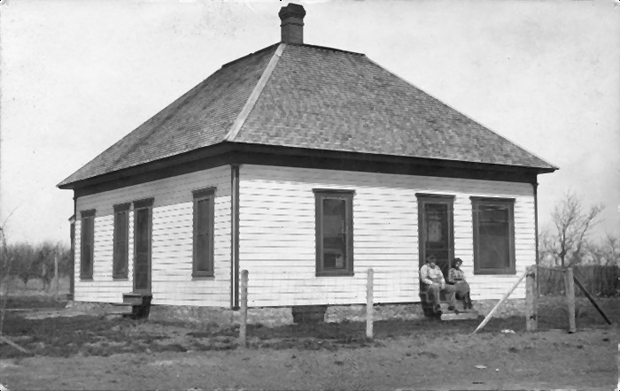
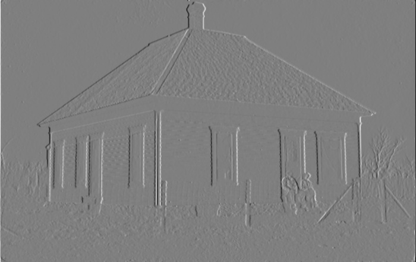
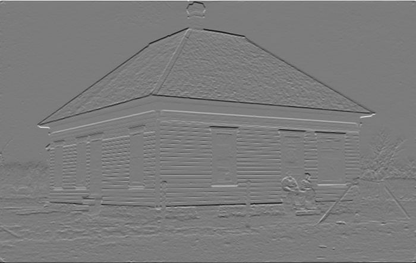
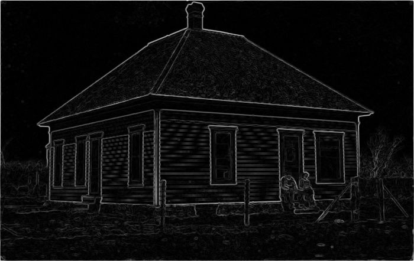
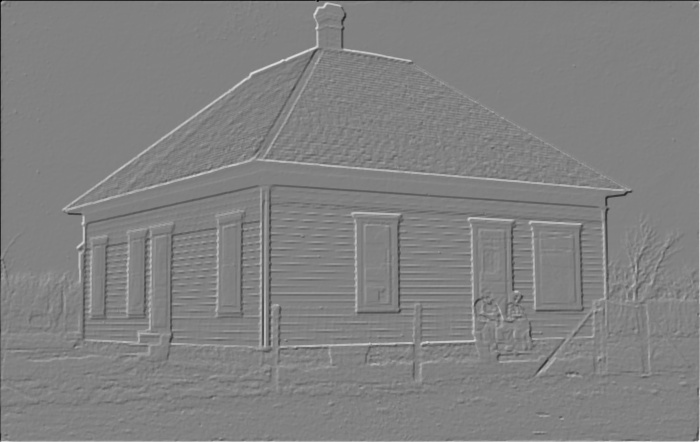
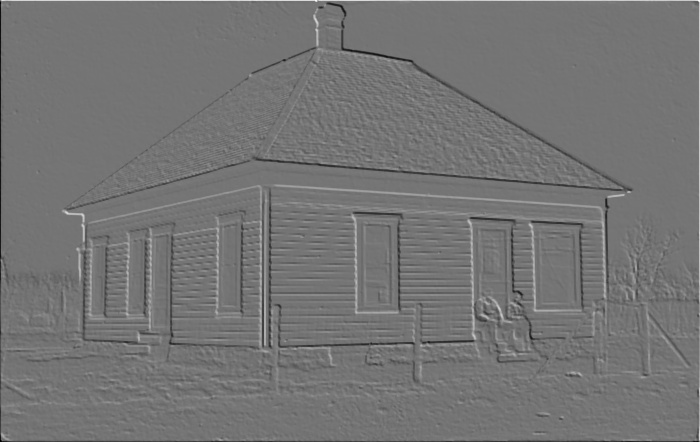

# Edge-Detection-Computer-Vision

* Fistly I have implemented the median filter for denoising the image.
  
* Next implemented convolution operation by flipping the kernel.
* Next I have used sobel_x and sobel_y filters to detect vertical and horizontal edges in the image by using the convolution operation.
  
   
* Computed the magnitude of vertical and horizontal edges and these are the combined edges:
   
*  Next I have used sobel_45 filter and sobel_135 filter to detect the diagonal edges.
   
   
